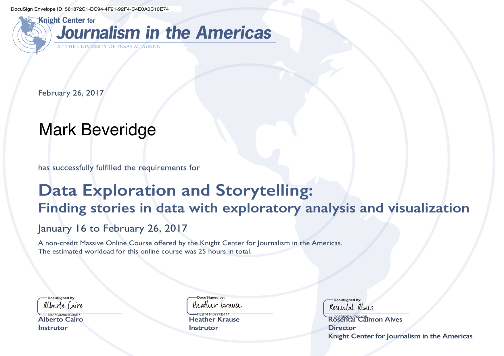

# Knight Center MOOC : "[Data Exploration and Storytelling](https://knightcenter.utexas.edu/00-17861-learn-how-find-stories-data-register-now-free-online-course-data-exploration-and-storytelli)"
###### 16/1/17 - 26/2/17

"The course will teach students how to extract journalistic stories from data using visualization, exploratory data analysis and other techniques. Participants will leave knowing how to find data, how to understand it, how to build stories using that data and how to implement best practices around ethics and data."

## Syllabus
### Module 1: “Finding and Understanding Data”
1. Overview of the module
2. Visualization for discovery
3. Finding Data
4. What is Data?
5. Understanding your data

### Module 2: “Character Development for your Data Story”
1. Overview of the module
2. Tools are great, but elementary principles are crucial
3. How to get started with TableauPublic, Excel and GoogleSheets
4. Why bother to clean and audit your data
5. 10 Basic Steps to Cleaning your data Pt1
6. 10 Basic Steps to Cleaning your data Pt2
7. 10 Basic Steps to Cleaning your data Pt3
8. Basic Cleaning Summary
9. Ethics of Data Cleaning

### Module 3: “Basic Plot Elements of Your Story”
1. Overview of the module
2. Visualization for Exploration
3. Basic data exploration
4. Getting started with analysis
5. Looking at one variable at a time Pt1
6. Looking at one variable at a time Pt2
7. Change in a variable Pt1
8. Change in a variable Pt2
9. Change in a variable Pt3
10. Ethics of univariate analysis

### Module 4: “Advancing the Plot of Your Story”
1. Overview of the module
2. The importance of context Pt1
3. The importance of context Pt2
4. The importance of context Pt3
5. Getting started looking at two variables at a time
6. Looking at two variables Pt1
7. Looking at two variables Pt2
8. Understanding Statistical Significance
9. Correlation really is not causation
10. Ethics of Confirmation Bias

### Module 5: “The Plot Thickens in your Data Story”
1. Overview of the module
2. Choosing graphic forms
3. How to represent your data
4. Graphic forms
5. What is multivariate analysis
6. First steps in combining datasets
7. Looking at 3+
8. Your three new best friends
9. Ethics of combining datasets

### Module 6: “Putting the Data Story Together”
1. Overview of the module
2. Emphasize the story
3. Visual narrative tricks
4. How to decide what to focus on in your story
5. Bottom line is transparency
6. How to communicate uncertainty
7. Ethics of reporting data to different audiences

